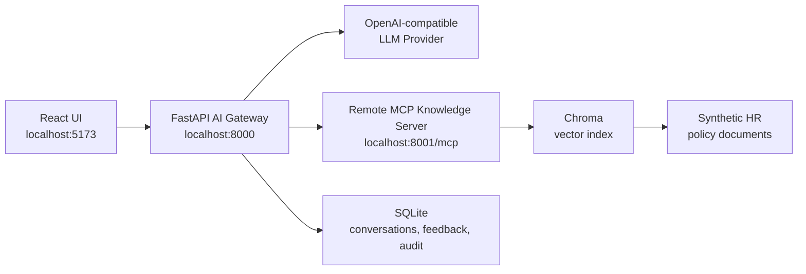

# Enterprise Knowledge Copilot

Enterprise Knowledge Copilot is a local full-stack reference implementation for an HR policy assistant. It combines a React chat interface, a FastAPI AI gateway, a remote MCP knowledge server, Chroma-backed semantic search, a SQLite conversation store, streaming responses, citations, and feedback capture.

The application is intentionally scoped as a proof of concept. It uses synthetic policy documents from `data/hr_policies/` and is designed to demonstrate reliable AI orchestration, tool use, source grounding, and operational documentation without requiring production infrastructure.

## Capabilities

- Streamed chat answers from a React + TypeScript UI.
- FastAPI-controlled tool loop using an OpenAI-compatible hosted LLM provider.
- Remote MCP server over Streamable HTTP for policy search and feedback tools.
- Chroma vector retrieval over eight synthetic HR policy documents.
- Source citations for grounded answers and insufficient-evidence behavior for weak retrieval matches.
- Local persistence for conversations, citations, feedback, and audit events.

## System Overview



FastAPI is the only MCP host/client. The LLM can request tools through OpenAI-compatible tool calls, but it never connects directly to the MCP server. FastAPI executes the MCP calls, filters low-confidence retrieval results, and streams status, answer tokens, citations, and completion metadata back to the UI.

## Repository Layout

| Path | Purpose |
| --- | --- |
| `frontend/` | React + TypeScript chat UI built with Vite. |
| `backend/` | FastAPI gateway, LLM orchestration, SSE streaming, SQLite persistence. |
| `mcp-server/` | Remote MCP server, Chroma retrieval, document ingestion, feedback tool. |
| `data/hr_policies/` | Synthetic policy corpus used for retrieval. |
| `docs/` | Architecture, design, governance, setup, and scale-out documentation. |
| `scripts/` | macOS and Windows setup helpers. |
| `storage/` | Local generated runtime data; ignored by Git. |

## Quick Start

Install prerequisites:

- Python 3.11 or newer
- Node.js 20 or newer
- npm 10 or newer
- A Groq API key, or another OpenAI-compatible provider configured in `.env`

Run setup from the repository root:

```bash
cp .env.example .env
# Edit OPENAI_API_KEY in .env.

python3 -m venv .venv
source .venv/bin/activate
python -m pip install --upgrade pip
pip install -r backend/requirements.txt -r mcp-server/requirements.txt

cd frontend
npm install
cd ..

PYTHONPATH=mcp-server python mcp-server/scripts/ingest_documents.py
```

Start the three local services in separate terminals:

```bash
source .venv/bin/activate
PYTHONPATH=mcp-server uvicorn mcp_server.main:app --host 0.0.0.0 --port 8001
```

```bash
source .venv/bin/activate
PYTHONPATH=backend uvicorn app.main:app --host 0.0.0.0 --port 8000 --reload
```

```bash
cd frontend
npm run dev
```

Open `http://localhost:5173`.

## Verification

```bash
curl http://localhost:8001/health
curl http://localhost:8000/api/health
```

Expected backend health includes `"llm_configured": true` after `.env` contains a valid API key.

Run tests and build checks:

```bash
source .venv/bin/activate
PYTHONPATH=backend pytest backend/tests
PYTHONPATH=mcp-server pytest mcp-server/tests

cd frontend
npm test
npm run build
```

## Demo Questions

- "Summarize our leave policy."
- "What is the escalation process for incidents?"
- "Find information about onboarding steps."
- "What is our policy for something not in the documents?"

## Documentation

- [Runbook](RUNBOOK.md)
- [Detailed Installation And Running Guide](docs/INSTALLATION_AND_RUNNING.md)
- [Architecture](docs/ARCHITECTURE.md)
- [Architecture Diagrams](docs/DIAGRAMS.md)
- [Design Rationale](docs/DESIGN.md)
- [Prompt And Tools](docs/PROMPT_AND_TOOLS.md)
- [Responsible AI And Governance](docs/RESPONSIBLE_AI.md)
- [Assumptions And Limitations](docs/ASSUMPTIONS_AND_LIMITATIONS.md)
- [Scale-Out Considerations](docs/SCALE_OUT.md)
- [Deliverables Mapping](docs/DELIVERABLES_MAPPING.md)

## Scope Notes

- The corpus is intentionally small and synthetic.
- The project does not implement production authentication, SSO, RBAC, tenant isolation, document-level authorization, deployment automation, or observability infrastructure.
- Generated answers are not authoritative policy decisions; users should review cited source excerpts.
