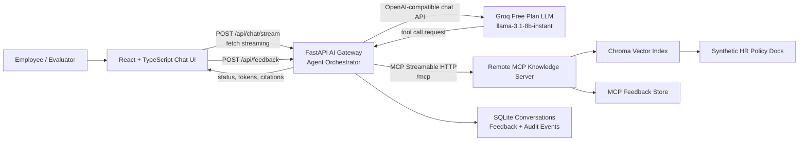
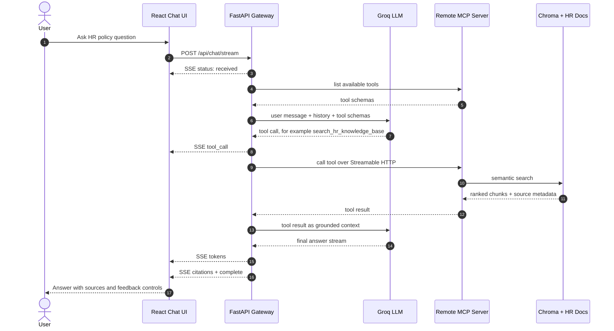
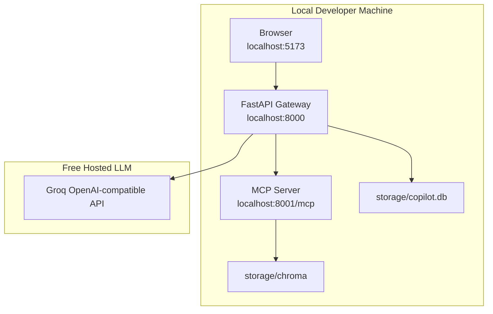
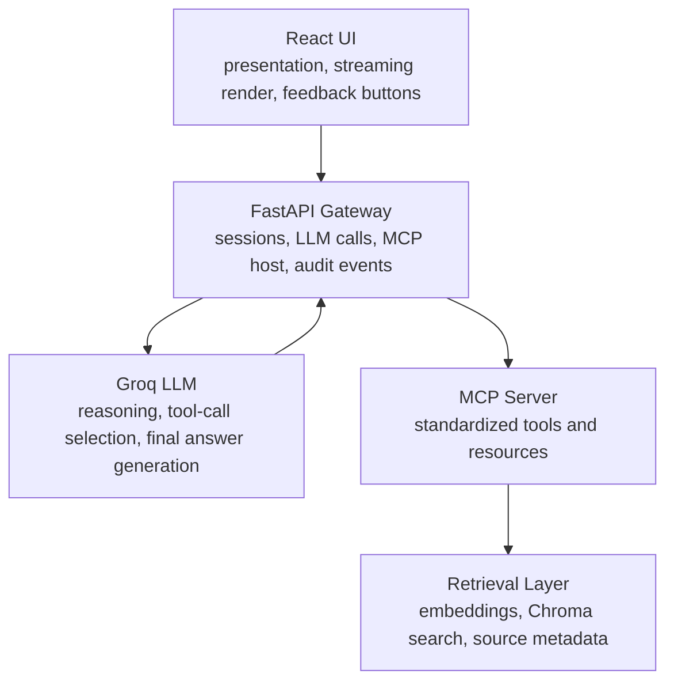

# Flow And Architecture Diagrams

## System Architecture

```mermaid
flowchart LR
    user["Employee / Evaluator"] --> ui["React + TypeScript Chat UI"]
    ui -->|"POST /api/chat/stream<br/>fetch streaming"| gateway["FastAPI AI Gateway<br/>Agent Orchestrator"]
    ui -->|"POST /api/feedback"| gateway

    gateway -->|"OpenAI-compatible chat API"| groq["Groq Free Plan LLM<br/>llama-3.1-8b-instant"]
    groq -->|"tool call request"| gateway
    gateway -->|"MCP Streamable HTTP<br/>/mcp"| mcp["Remote MCP Knowledge Server"]
    mcp --> chroma["Chroma Vector Index"]
    chroma --> docs["Synthetic HR Policy Docs"]
    gateway --> sqlite["SQLite Conversations<br/>Feedback + Audit Events"]
    mcp --> feedback["MCP Feedback Store"]

    gateway -->|"status, tokens, citations"| ui
```

## Chat Request Flow

```mermaid
sequenceDiagram
    autonumber
    actor User
    participant UI as React Chat UI
    participant API as FastAPI Gateway
    participant LLM as Groq LLM
    participant MCP as Remote MCP Server
    participant KB as Chroma + HR Docs

    User->>UI: Ask HR policy question
    UI->>API: POST /api/chat/stream
    API-->>UI: SSE status: received
    API->>MCP: list available tools
    MCP-->>API: tool schemas
    API->>LLM: user message + history + tool schemas
    LLM-->>API: tool call, for example search_hr_knowledge_base
    API-->>UI: SSE tool_call
    API->>MCP: call tool over Streamable HTTP
    MCP->>KB: semantic search
    KB-->>MCP: ranked chunks + source metadata
    MCP-->>API: tool result
    API->>LLM: tool result as grounded context
    LLM-->>API: final answer stream
    API-->>UI: SSE tokens
    API-->>UI: SSE citations + complete
    UI-->>User: Answer with sources and feedback controls
```

## Local POC Deployment

```mermaid
flowchart TB
    subgraph "Local Developer Machine"
        browser["Browser<br/>localhost:5173"]
        fastapi["FastAPI Gateway<br/>localhost:8000"]
        mcpserver["MCP Server<br/>localhost:8001/mcp"]
        chroma["storage/chroma"]
        sqlite["storage/copilot.db"]
    end

    subgraph "Free Hosted LLM"
        groq["Groq OpenAI-compatible API"]
    end

    browser --> fastapi
    fastapi --> groq
    fastapi --> mcpserver
    mcpserver --> chroma
    fastapi --> sqlite
```

## Responsibility Split

```mermaid
flowchart TD
    ui["React UI<br/>presentation, streaming render, feedback buttons"]
    api["FastAPI Gateway<br/>sessions, LLM calls, MCP host, audit events"]
    llm["Groq LLM<br/>reasoning, tool-call selection, final answer generation"]
    mcp["MCP Server<br/>standardized tools and resources"]
    retrieval["Retrieval Layer<br/>embeddings, Chroma search, source metadata"]

    ui --> api
    api --> llm
    llm --> api
    api --> mcp
    mcp --> retrieval
```

